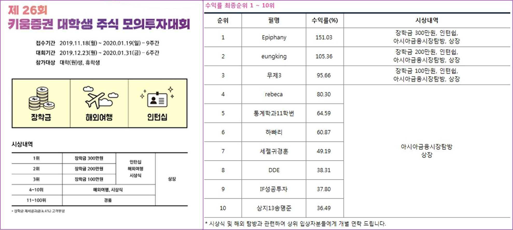

# Knee2Shoulder
**Stock market predictor** :  
Trading stocks automatically by predicting future value using artificial intelligence

  

  

the Final Goal : Top 100

## Participants
* 김성록 - [무릎에서 사서 어깨에서 팔자](https://www.notion.so/casselkim/76a5c957397d40b584ffd70a59208a8a)
* 김주원
* 박건욱
* 신준철
* 우진장
* 윤치호
* 이준병
* 이준기

## Reference
### Main reference
  
파이썬과 케라스를 이용한 딥러닝/강화학습,주식투자
### Sub reference
[Kaggle - stock prediction with news data](https://www.kaggle.com/c/two-sigma-financial-news)  
